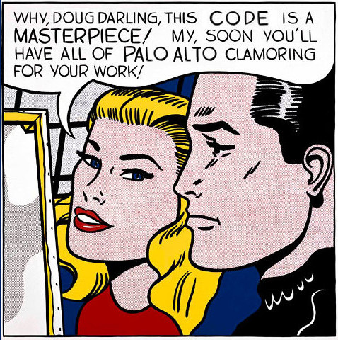

# 100 Days Of Code - Log

## Day 1: May 8, 2023 

### WordPress 
Worked with WordPress, which was clearly created by Satan
and his minions. I've used it to edit pages on a site that someone else set up, 
and that was fine; trying to set up a site from scratch (working with my sister Jude 
on this) was absolutely maddening. Some things could be edited in the WP 
panel, other things in the Cornerstone editor, and some things just
kind of appeared whether we wanted them to or not. Insane. 

**Thoughts:** Should you take the down escalator after your death
and Satan offers either red-hot pokers applied to your flesh or 
"just implement this site in WordPress and you can go," take the 
seared flesh. You'll thank me. 

### Der Plan

Stunned by how broken the 
[Free Code Camp](https://freecodecamp.org) 
website is. Really pathetic, can't get anything to 
work. At any rate, here's a list of the certifications 
I want to get, although I  
may have to find them on [Udemy](https://udemy.com) instead.

* Responsive Web Design certification
* JavaScript Algorithm and Data Structures certification
* Front End Development Libraries certification
* Data Visualization certification (D3 stuff, sounds really cool)
* Back End Development and APIs certification
* Information Security certification 
* Scientific Computing with Python certification
* Data Analysis with Python certification
* Machine Learning with Python certification 

Would love to have the certifications for my 
[LinkedIn profile](https://linkedin.com/in/doug3000), but 
that may not be possible with the sorry state of Free Code Camp. 
Will try it again tomorrow, maybe this is just a temporary 
condition. Regardless, getting the skills is the main thing, 
if I get a gold star that's a bonus.
